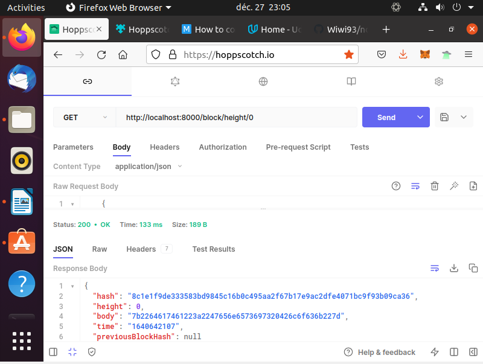
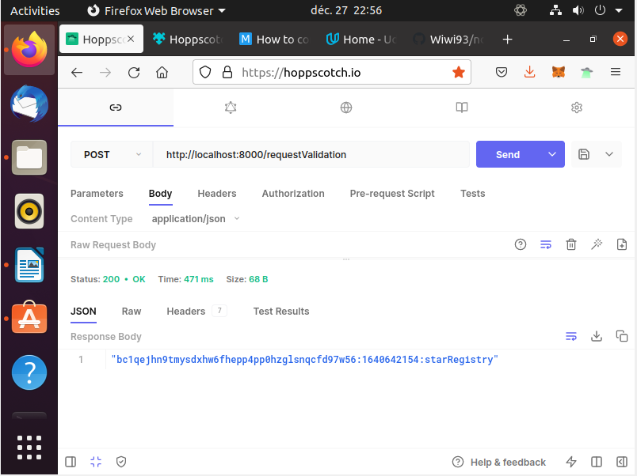
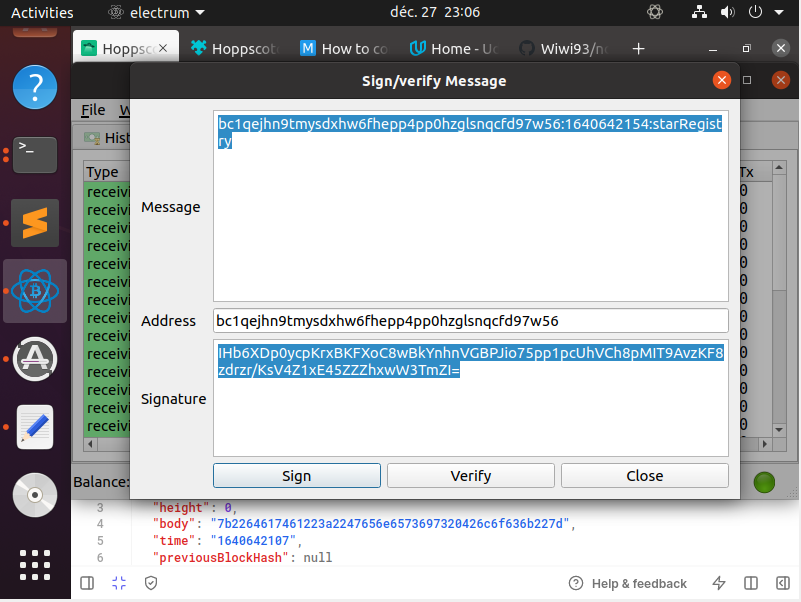
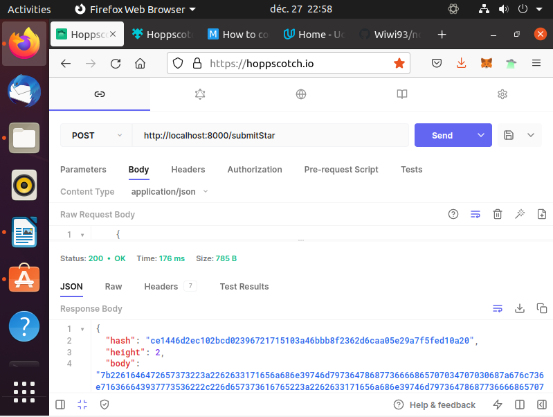
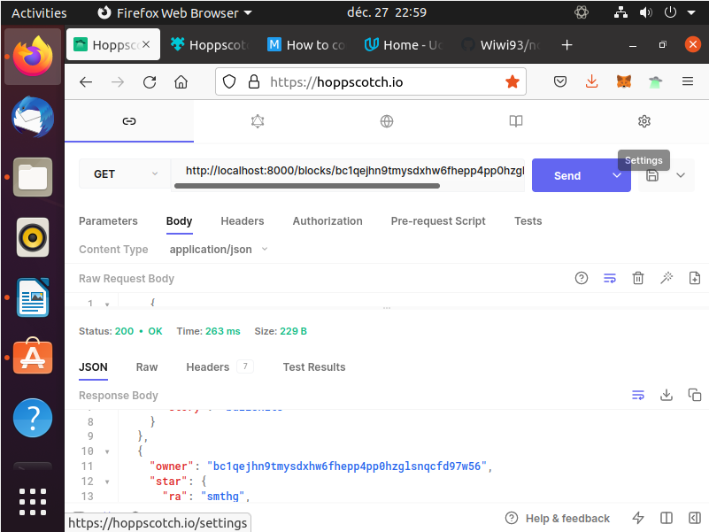
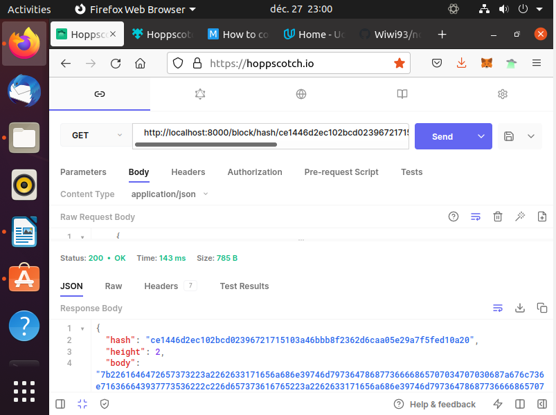

# Private Blockchain Application

## How to test your application functionalities?

1. Run your application using the command `node app.js`
You should see in your terminal a message indicating that the server is listening in port 8000:
> Server Listening for port: 8000

2. To make sure your application is working fine and it creates the Genesis Block you can use POSTMAN to request the Genesis block:
    
3. Make your first request of ownership sending your wallet address:
    
4. Sign the message with your Wallet:
    
5. Submit your Star
     
6. Retrieve Stars owned by me
    
7. Retrieve Stars by hash

